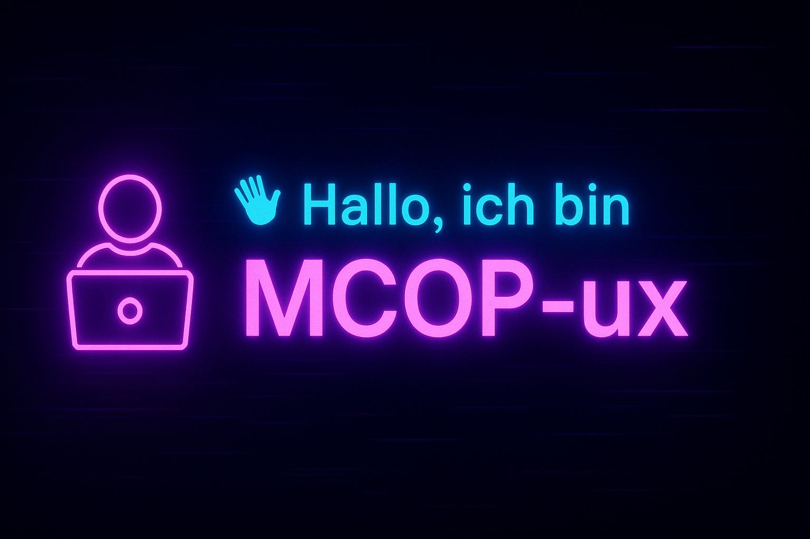

  

# 👋 Hallo, ich bin **MCOP-ux**  
   

---

## 👨‍💻 Über Mich  
Ich bin **Softwareentwickler** mit einer Leidenschaft für **sauberen Code** und **clevere Problemlösungen**.  
Mein Fokus liegt auf:  
- 🚀 **Backend-Entwicklung** mit **Python** & **C/C++**  
- 🌐 **Dynamischen Webanwendungen** mit **JavaScript**  
- ⚙️ **Automatisierung von Geschäftsprozessen** mit **Google Apps Script**  

---

## 🛠️ Mein Tech-Stack  

**Programmiersprachen & Technologien:**  

  
  
  
  
  

  

**Weitere Tools & Technologien:**  
- 🎨 **Frontend:** HTML, CSS, React.js  
- ⚙️ **Backend:** Node.js, Python  
- 🗄️ **Datenbanken:** MySQL, PostgreSQL  
- 🛠️ **Tools:** Git, Docker, VS Code, GitHub Actions  

---

## 🌟 Ausgewählte Projekte  

| 🚀 Projekt | 📝 Beschreibung | 🛠️ Technologien | 🔗 Link |
|------------|----------------|-----------------|---------|
| **Trail-Scout-Expedition** | Wander-Gadget für Tracking, Feedback und Sicherheit auf langen Touren | `Python`, `C`, `LoRa`, `GPS` | [GitHub-Repo](https://github.com/MCOP-ux/Trail-Scout-Expedition) |

---

## 📊 GitHub-Statistiken  

  
  

  

---

## 🎨 Design & Erweiterungen  

  
  
  

---

## 📬 Kontakt  

- 💻 **GitHub:** [MCOP-ux](https://github.com/MCOP-ux)  
- 📩 **E-Mail:** *Auf Anfrage*  

---

> 💡 *"Code ist Kunst – und jedes Problem eine neue Leinwand."* 🎨  
